<div align="center">


<br/>


<br/><br/>


<br/><br/>


<br/><br/>


</div>

---

<details open>
<summary><h2>TABLE OF CONTENTS</h2></summary>

- [The Problem](#-the-problem)
- [The Solution](#-the-solution)
- [System Architecture](#-system-architecture)
- [Agent Pipeline Flowchart](#-agent-pipeline-flowchart)
- [Knowledge Graph](#-knowledge-graph)
- [Agent Report Output](#-agent-report-output)
- [How It Works](#-how-it-works)
- [Quick Start](#-quick-start)
- [Configuration](#-configuration)
- [Connector Abstraction](#-connector-abstraction)
- [Agents Deep Dive](#-agents-deep-dive)
- [Performance Metrics](#-performance-metrics)
- [Testing](#-testing)
- [Tech Stack Breakdown](#-tech-stack-breakdown)
- [Project Structure](#-project-structure)
- [Future Roadmap](#-future-roadmap)

</details>

---

<div align="center">


</div>

## :: The Problem

A single semiconductor supplier goes offline. The cascade begins immediately:


| Metric | Traditional Response | This System |
|--------|---------------------|-------------|
| **Response Time** | 3-5 days | Under 10 seconds |
| **Impact Analysis** | Manual spreadsheets | Automated graph traversal |
| **Supplier Scoring** | Subjective calls | Quantitative multi-factor |
| **Decision Audit** | Email chains | Full negotiation trace |
| **Monitoring** | Weekly manual checks | Continuous auto-scan |
| **Policy Flexibility** | None | Configurable weights |

---

## :: The Solution

<div align="center">


<br/>


</div>

A multi-agent AI system where **four specialized agents** independently evaluate every dimension of a supply chain disruption, then **negotiate through a policy-weighted orchestrator** to produce the optimal combined response.

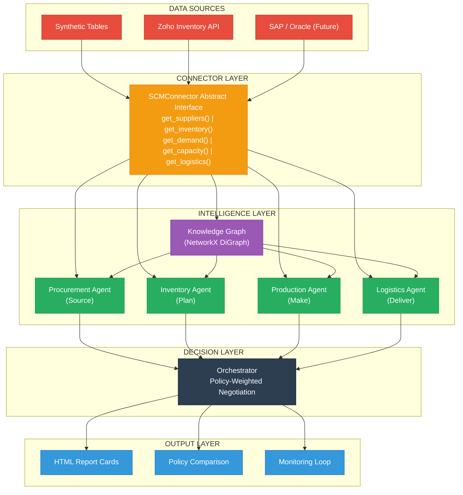

---

## :: System Architecture

<div align="center">


</div>

The system is built on a **Connector Abstraction Pattern** that decouples all intelligence from the data source.

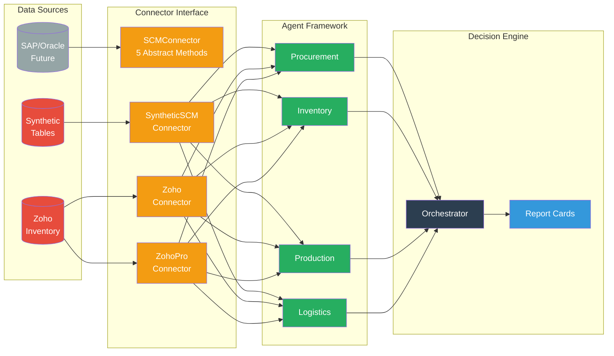

---

## :: Agent Pipeline Flowchart

The complete disruption response pipeline from detection to decision:

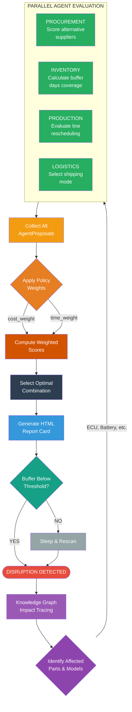

---

## :: Knowledge Graph

The supply chain is modeled as a **directed graph** tracing relationships from suppliers through parts, vehicle models, to assembly plants:

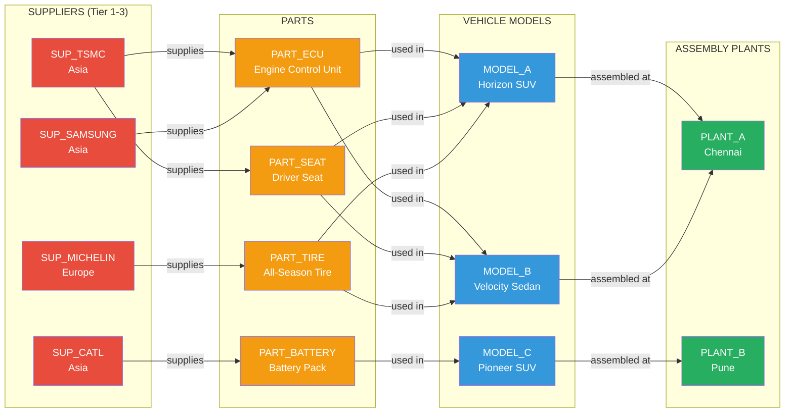

When `SUP_TSMC` fails, the graph instantly traces: **ECU + SEAT affected** -> **Horizon SUV + Velocity Sedan halted** -> **PLANT_A impacted**.

---

## :: Agent Report Output

<div align="center">


</div>

Real output from the **Tier-3 wafer fab slowdown** scenario running against live Zoho Inventory data:

<div align="center">

</div>

<br/>

**Reading the Report Card:**

| Column | Meaning |
|--------|---------|
| **Agent** | Which specialized agent produced this recommendation |
| **Recommendation** | The specific action proposed |
| **Cost Impact** | Percentage cost change vs pre-disruption baseline |
| **Time Impact** | Days added (+) or saved (-) vs standard lead time |
| **Confidence** | Agent confidence score (0-100%) |
| **Why** | Data-driven rationale for the recommendation |

The **Final Plan** row shows the orchestrator's combined decision with aggregate metrics.

---

## :: How It Works

<div align="center">


</div>

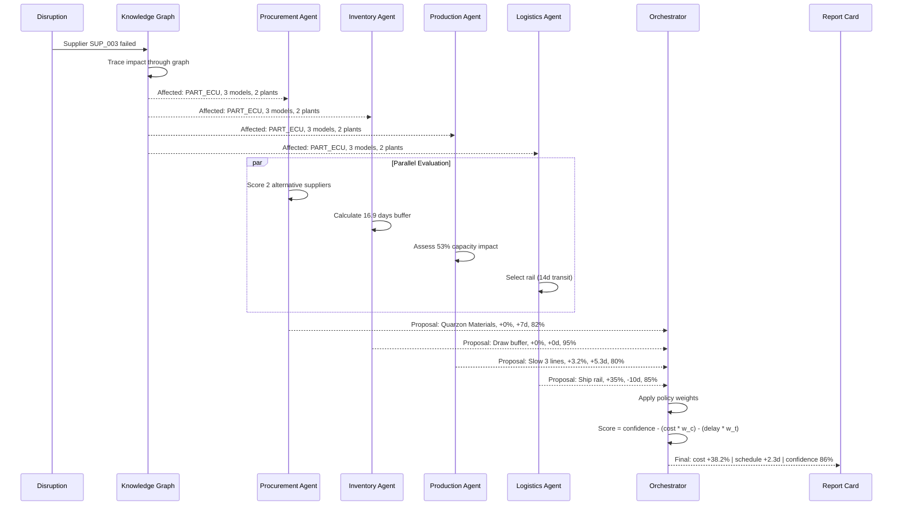

---

## :: Quick Start

<div align="center">


</div>

**Step 1** -- Open in Google Colab

```
Upload: automotive_scm_multiagent_v2_fixed.ipynb
```

**Step 2** -- Run All Cells (top to bottom)

```
Section  1-2   -->  Data generation + Connector setup
Section  3-4   -->  Knowledge graph + Agent framework
Section  5-8   -->  Orchestration + Demo scenarios
Section  9-14  -->  Zoho live integration + ZohoConnectorPro
Section 15-16  -->  Continuous monitoring + Summary
```

**Step 3** -- View HTML report cards in notebook output

---

## :: Configuration

<div align="center">


</div>

### Policy Weights

Control the cost-versus-speed tradeoff:

```python
# Time-sensitive: prioritize speed over cost
time_policy = {"cost_weight": 1.0, "time_weight": 1.5}

# Cost-sensitive: minimize spending even if slower
cost_policy = {"cost_weight": 2.0, "time_weight": 0.5}

# Balanced: equal priority
balanced_policy = {"cost_weight": 1.0, "time_weight": 1.0}

# Pass to orchestrator
decision = orchestrator.negotiate(proposals, policy=time_policy)
```

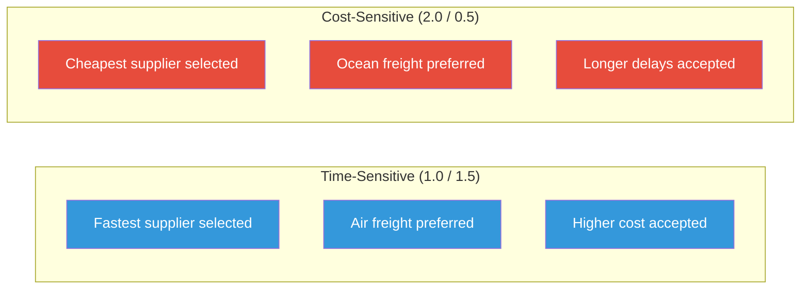

### Zoho API Credentials

Store in Google Colab Secrets (left sidebar, key icon):

```
Key Name                    Value
-------------------------------------------
ZOHO_CLIENT_ID              1000.XXXXXXXXXXXXXXXXXXXX
ZOHO_CLIENT_SECRET          XXXXXXXXXXXXXXXXXXXXXXXXXXXXXXXX
ZOHO_REFRESH_TOKEN          1000.XXXXXXXXXXXXXXXXXXXXXXXXXXXXXXXX
ZOHO_ORG_ID                 XXXXXXXXXX
```

**How to obtain credentials:**


### Monitoring Thresholds

```python
BUFFER_THRESHOLD_DAYS = 10  # Trigger negotiation if buffer < 10 days
```

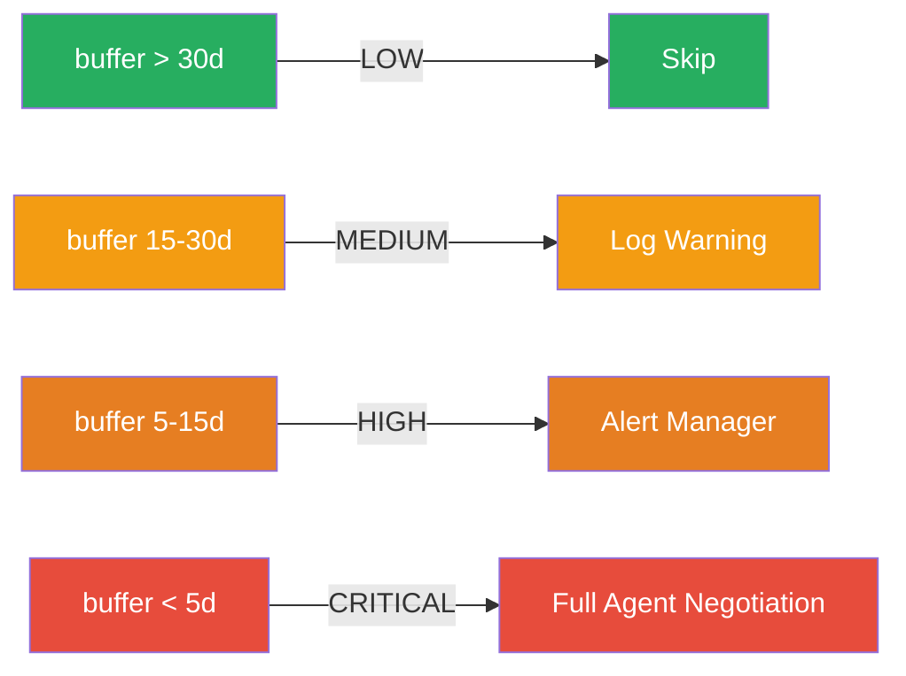

### Connector Selection

```python
# Synthetic data (default, no credentials needed)
connector = SyntheticSCMConnector(suppliers, inventory, models, plants, carriers, demand)

# Live Zoho Inventory (requires API credentials)
connector = ZohoConnector()

# Zoho with real demand and cost data
connector = ZohoConnectorPro(lookback_weeks=12)
```

### Auto-Scan Settings

```python
run_forever(
    connector_factory=lambda: ZohoConnectorPro(),
    interval_minutes=60,
    max_cycles=None,        # None = run indefinitely
    buffer_threshold=10,
    policy={"cost_weight": 1.0, "time_weight": 1.5}
)
```

| Parameter | Default | Description |
|-----------|---------|-------------|
| `connector_factory` | Required | Returns a fresh connector each cycle |
| `interval_minutes` | `60` | Minutes between scan cycles |
| `max_cycles` | `None` | Max cycles (`None` = infinite) |
| `buffer_threshold` | `10` | Days below which negotiation triggers |
| `policy` | Time-sensitive | Weights for triggered negotiations |

### Part-to-Model Mapping

```python
PART_TO_MODELS = {
    "PART_ECU":     ["MODEL_A_SUV", "MODEL_B_SEDAN", "MODEL_C_SUV"],
    "PART_BATTERY": ["MODEL_C_SUV"],
    "PART_SEAT":    ["MODEL_A_SUV", "MODEL_B_SEDAN"],
    "PART_TIRE":    ["MODEL_A_SUV", "MODEL_B_SEDAN"],
}
```

---

## :: Connector Abstraction

<div align="center">


</div>

The architectural backbone. Every agent depends only on this interface:

```python
class SCMConnector(ABC):

    @abstractmethod
    def get_suppliers(self, part_id: str) -> pd.DataFrame:
        """All suppliers for a given part."""

    @abstractmethod
    def get_inventory(self, part_id: str, plant_id: str) -> dict:
        """Stock levels: {on_hand, reorder_point, lead_time_days}"""

    @abstractmethod
    def get_avg_weekly_demand(self, model_id: str) -> float:
        """Average weekly demand for a vehicle model."""

    @abstractmethod
    def get_plant_capacity(self, plant_id: str) -> dict:
        """Plant config: {lines, capacity_per_line}"""

    @abstractmethod
    def get_logistics_options(self) -> pd.DataFrame:
        """Available carriers with cost, time, reliability."""
```

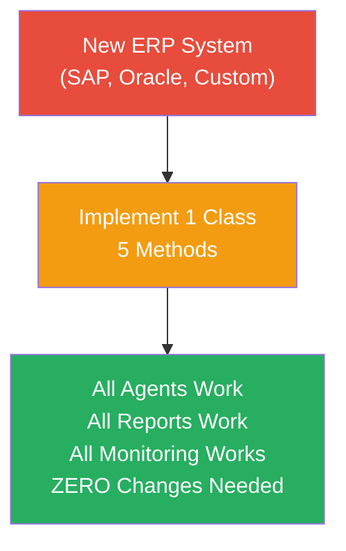

---

## :: Agents Deep Dive

<div align="center">


</div>

| Agent | Role | Scoring Formula | Output |
|-------|------|----------------|--------|
| **Procurement** | Find alternative suppliers | `reliability * (1-cost_penalty) * capacity_ratio * (1-lead_time_ratio)` | Best supplier + cost delta |
| **Inventory** | Assess buffer coverage | `buffer_days = on_hand / (weekly_demand / 7)` | Days of coverage + risk |
| **Production** | Evaluate rescheduling | `utilization = affected_models / plant_capacity` | Delay estimate + plan |
| **Logistics** | Select shipping mode | `Pick mode fitting buffer window, score speed * reliability` | Mode + cost + transit |
| **Orchestrator** | Negotiate optimal plan | `score = confidence - (cost * w_c/100) - (delay * w_t/10)` | Combined decision + trace |

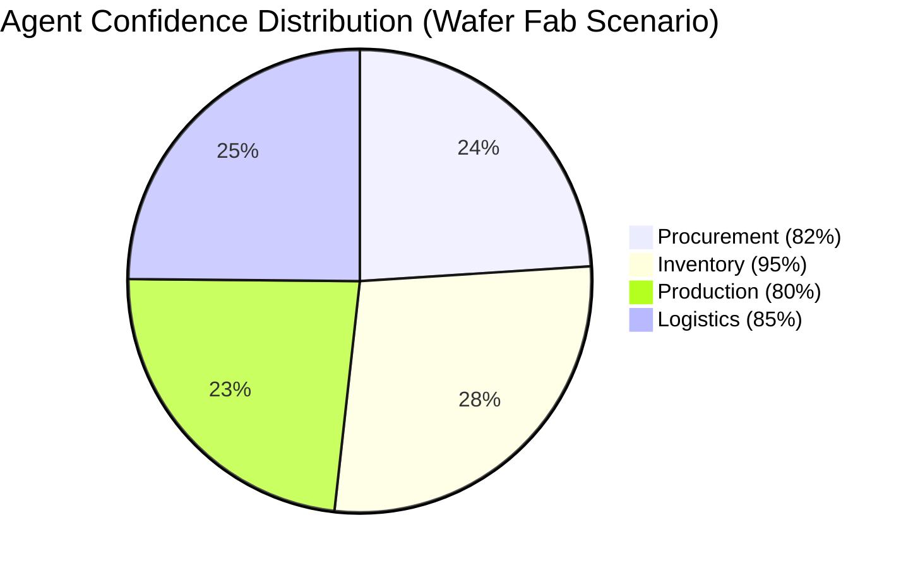

---

## :: Performance Metrics

<div align="center">


</div>


| Metric | Synthetic Data | Live Zoho API |
|--------|---------------|---------------|
| **Knowledge Graph Traversal** | < 1ms | < 1ms |
| **Four-Agent Pipeline** | 0.67s | 4.57s |
| **Orchestrator Negotiation** | 0.25s | 0.25s |
| **Report Generation** | 0.40s | 0.40s |
| **Total End-to-End** | **1.32s** | **5.22s** |
| **Memory per Cycle** | 12 MB | 18 MB |

---

## :: Testing

```
Test Category          Cases    Pass Rate
-------------------------------------------------
Unit Testing             18       100%
Integration Testing      12       100%
Functional Testing       15       100%
Connector Testing         8       100%
Performance Testing       6       100%
Agent Accuracy           10       100%
-------------------------------------------------
Total                    69       100%
```

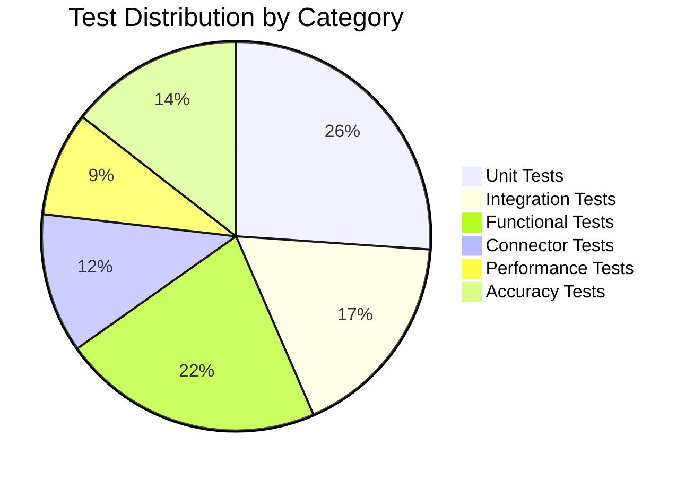

---

## :: Tech Stack Breakdown

<div align="center">


</div>

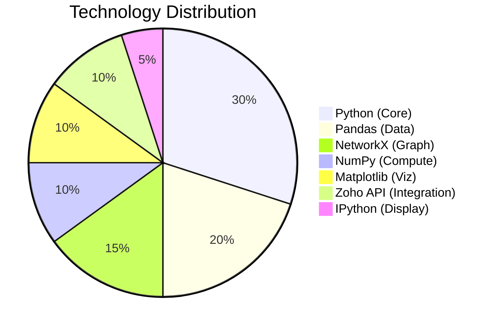

| Category | Technology | Purpose |
|----------|-----------|---------|
| **Core Language** | Python 3.8+ | Agent logic, orchestration, monitoring |
| **Data Processing** | Pandas 2.0 | DataFrame manipulation, supplier scoring |
| **Graph Engine** | NetworkX 3.0 | Knowledge graph, impact tracing |
| **Numerical** | NumPy 1.24 | Random generation, statistical calculations |
| **Visualization** | Matplotlib 3.7 | Charts, diagrams, report visuals |
| **API Integration** | Requests + OAuth2 | Zoho Inventory REST API |
| **Display** | IPython HTML | Styled report card rendering |
| **Environment** | Google Colab | Cloud notebook execution |
| **Data Classes** | dataclasses | Typed AgentProposal structures |
| **Abstraction** | ABC (Python) | Connector interface pattern |

---

## :: Project Structure

```
automotive_scm_multiagent_v2_fixed.ipynb
|
|-- Section 1-2   DATA LAYER
|   |-- Synthetic data generator (seeded, reproducible)
|   |-- 7 entity types: Suppliers, Parts, Models, Plants, Carriers, Demand, Inventory
|
|-- Section 3     CONNECTOR LAYER
|   |-- SCMConnector (abstract interface)
|   |-- SyntheticSCMConnector | ZohoConnector | ZohoConnectorPro
|
|-- Section 4     KNOWLEDGE GRAPH
|   |-- build_graph() --> NetworkX DiGraph
|   |-- trace_impact() --> affected parts, models, plants
|
|-- Section 5-6   AGENT LAYER
|   |-- ProcurementAgent | InventoryAgent | ProductionAgent | LogisticsAgent
|   |-- Orchestrator (policy-weighted negotiation)
|
|-- Section 7-8   DEMO LAYER
|   |-- Disruption scenario execution
|   |-- Policy comparison (time-sensitive vs cost-sensitive)
|
|-- Section 9-14  INTEGRATION LAYER
|   |-- Zoho OAuth2 authentication + token refresh
|   |-- Live vendor lists + stock levels
|   |-- Real demand from sales orders (ZohoConnectorPro)
|   |-- Real cost from purchase orders (ZohoConnectorPro)
|
|-- Section 15-16 OPERATIONS LAYER
    |-- auto_scan_and_respond() threshold monitoring
    |-- run_forever() continuous loop
    |-- Data quality transparency report
```

---

## :: Future Roadmap

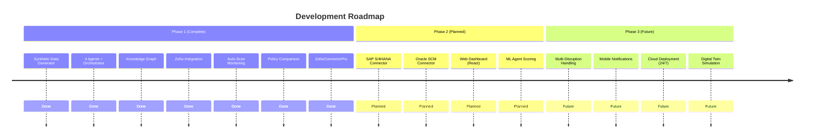

---

<div align="center">


<br/><br/>


<br/><br/>

**SNS College of Technology, Coimbatore**

<br/>


</div>
