<div align="center">


<br/>


<br/><br/>

<a href="#"></a>
<a href="#"></a>
<a href="#"></a>
<a href="#"></a>
<a href="#"></a>
<a href="#"></a>

<br/><br/>


</div>

<br/>

<div align="center">
<table>
<tr>
<td width="50%" align="center">

**The Old Way**

```
Day 1: Supplier fails
Day 2: Emails. Phone calls. Panic.
Day 3: Spreadsheet analysis begins
Day 4: Cross-team meeting scheduled
Day 5: Decision made. Too late.
       Production lines already idle.
       $11.5M lost.
```

</td>
<td width="50%" align="center">

**This System**

```
Second 0:  Disruption detected
Second 1:  Knowledge graph traces impact
Second 2:  4 agents score alternatives
Second 3:  Orchestrator negotiates plan
Second 4:  Report card generated
           ===========================
           Total: 4 seconds. $0 lost.
```

</td>
</tr>
</table>
</div>

---

## 01 // Disruption Cascade

> *A single supplier fails. The ripple reaches every corner of the supply chain.*

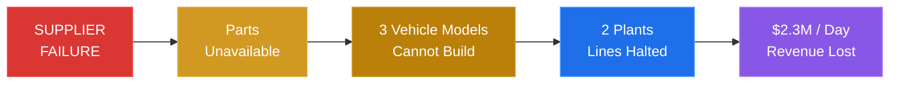

---

## 02 // System Architecture

> *Five layers. One mission. Connector abstraction makes it ERP-agnostic.*

```mermaid
graph TB
    subgraph SOURCES["DATA SOURCES"]
        direction LR
        S1["Synthetic<br/>Tables"]:::red
        S2["Zoho Inventory<br/>REST API"]:::red
        S3["SAP / Oracle<br/>Future"]:::grey
    end

    subgraph CONNECTOR["CONNECTOR ABSTRACTION LAYER"]
        CL["SCMConnector Interface<br/>get_suppliers -- get_inventory -- get_demand<br/>get_capacity -- get_logistics"]:::orange
    end

    subgraph GRAPH["KNOWLEDGE GRAPH"]
        KG["NetworkX DiGraph<br/>Supplier --> Part --> Model --> Plant<br/>Sub-millisecond impact tracing"]:::purple
    end

    subgraph AGENTS["AGENT FRAMEWORK"]
        direction LR
        PA["Procurement<br/>Agent"]:::green
        IA["Inventory<br/>Agent"]:::green
        PRA["Production<br/>Agent"]:::green
        LA["Logistics<br/>Agent"]:::green
    end

    subgraph DECISION["ORCHESTRATOR"]
        OR["Policy-Weighted Negotiation Engine<br/>cost_weight and time_weight<br/>Scored ranking with full trace"]:::dark
    end

    subgraph OUTPUT["OUTPUT"]
        direction LR
        RC["HTML Report<br/>Cards"]:::blue
        PC["Policy<br/>Comparison"]:::blue
        ML["Monitoring<br/>Loop"]:::blue
    end

    SOURCES --> CONNECTOR --> GRAPH --> AGENTS --> DECISION --> OUTPUT

    classDef red fill:#da3633,stroke:#f85149,color:#fff
    classDef orange fill:#d29922,stroke:#e3b341,color:#fff
    classDef purple fill:#8957e5,stroke:#bc8cff,color:#fff
    classDef green fill:#238636,stroke:#3fb950,color:#fff
    classDef dark fill:#30363d,stroke:#8b949e,color:#c9d1d9
    classDef blue fill:#1f6feb,stroke:#58a6ff,color:#fff
    classDef grey fill:#484f58,stroke:#6e7681,color:#8b949e
```

---

## 03 // Agent Pipeline

> *From disruption detection to decision output -- the complete flowchart.*

```mermaid
flowchart TD
    START(["DISRUPTION DETECTED"]):::red
    START --> TRACE["Knowledge Graph traces impact<br/>Supplier --> Parts --> Models --> Plants"]:::purple
    TRACE --> SCOPE{"Identify all affected<br/>parts, models, plants"}:::purple

    SCOPE --> PARALLEL

    subgraph PARALLEL["PARALLEL AGENT EVALUATION"]
        direction LR
        AG1["PROCUREMENT<br/>----------<br/>Score alt suppliers<br/>reliability * cost<br/>* capacity * lead"]:::green
        AG2["INVENTORY<br/>----------<br/>Buffer coverage<br/>buffer_days =<br/>on_hand / demand"]:::green
        AG3["PRODUCTION<br/>----------<br/>Line utilization<br/>impact = affected<br/>/ total_capacity"]:::green
        AG4["LOGISTICS<br/>----------<br/>Shipping mode<br/>Air / Rail / Truck<br/>within buffer"]:::green
    end

    PARALLEL --> COLLECT["Collect 4 AgentProposal objects"]:::orange
    COLLECT --> NEGOTIATE["Orchestrator applies policy weights<br/>score = confidence - cost_penalty - delay_penalty"]:::dark
    NEGOTIATE --> REPORT["Generate styled HTML report card<br/>Color-coded proposals + negotiation trace"]:::blue
    REPORT --> SCAN{"Auto-scan:<br/>buffer below threshold?"}:::orange
    SCAN -->|"YES"| START
    SCAN -->|"NO"| WAIT["Sleep then rescan"]:::grey
    WAIT --> START

    classDef red fill:#da3633,stroke:#f85149,color:#fff
    classDef purple fill:#8957e5,stroke:#bc8cff,color:#fff
    classDef green fill:#238636,stroke:#3fb950,color:#fff
    classDef orange fill:#d29922,stroke:#e3b341,color:#fff
    classDef dark fill:#30363d,stroke:#8b949e,color:#c9d1d9
    classDef blue fill:#1f6feb,stroke:#58a6ff,color:#fff
    classDef grey fill:#484f58,stroke:#6e7681,color:#8b949e
```

---

## 04 // Knowledge Graph

> *The supply chain as a directed graph. Trace any disruption in milliseconds.*

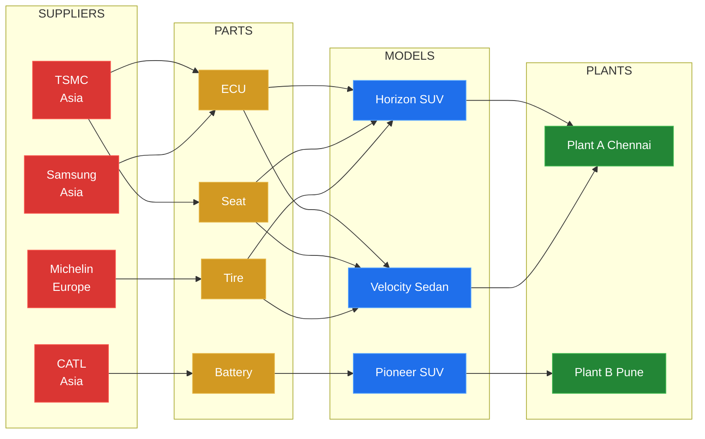

**Example trace** -- TSMC goes offline:
```
TSMC fails --> ECU + Seat affected --> Horizon SUV + Velocity Sedan halted --> Plant A impacted
Result: 2 parts, 2 models, 1 plant identified in < 1ms
```

---

## 05 // Live Report Output

> *Real output from a Tier-3 wafer fab slowdown scenario on live Zoho data.*

<div align="center">

</div>

<br/>

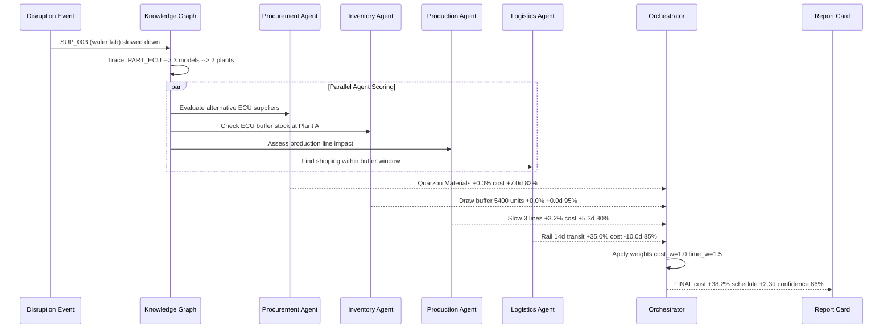

---

## 06 // Quick Start

```
STEP 1    Upload notebook to Google Colab
          automotive_scm_multiagent_v2_fixed.ipynb

STEP 2    Run All Cells (top to bottom)
          Section  1-2    Data generation + Connectors
          Section  3-4    Knowledge graph + Agents
          Section  5-8    Orchestration + Demo scenarios
          Section  9-14   Zoho live integration
          Section 15-16   Continuous monitoring

STEP 3    View HTML report cards in output cells
```

---

## 07 // Configuration Guide

<div align="center">


</div>

### 7.1 Policy Weights

```python
# Time-sensitive: prioritize speed, accept higher cost
time_policy = {"cost_weight": 1.0, "time_weight": 1.5}

# Cost-sensitive: minimize spending, accept delays
cost_policy = {"cost_weight": 2.0, "time_weight": 0.5}

# Balanced: equal priority on both dimensions
balanced_policy = {"cost_weight": 1.0, "time_weight": 1.0}

# Usage
decision = orchestrator.negotiate(proposals, policy=time_policy)
```

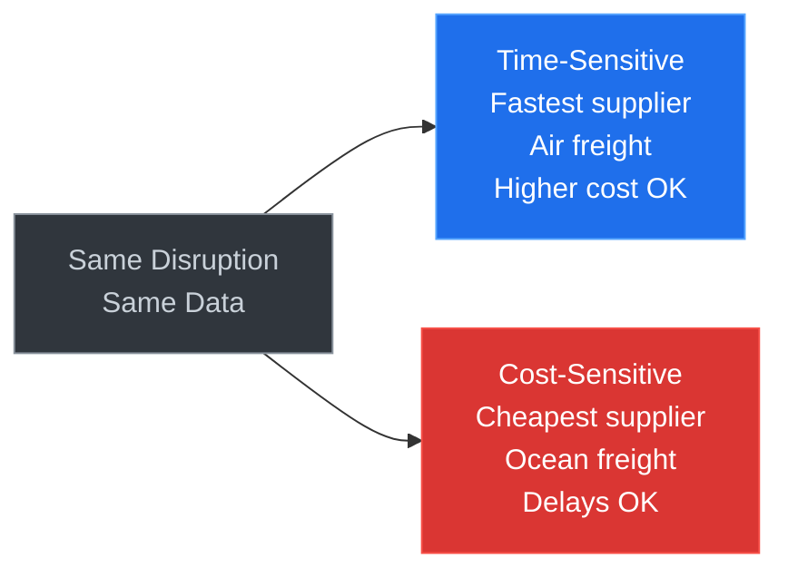

### 7.2 Zoho API Credentials

Store in **Google Colab Secrets** (left sidebar > key icon):

| Secret Name | Where to Find It |
|------------|-----------------|
| `ZOHO_CLIENT_ID` | api-console.zoho.in > Self Client > Client ID |
| `ZOHO_CLIENT_SECRET` | api-console.zoho.in > Self Client > Client Secret |
| `ZOHO_REFRESH_TOKEN` | Generated during OAuth2 scope authorization |
| `ZOHO_ORG_ID` | Zoho Inventory > Settings > Organization Profile |


### 7.3 Monitoring Thresholds

```python
BUFFER_THRESHOLD_DAYS = 10
```

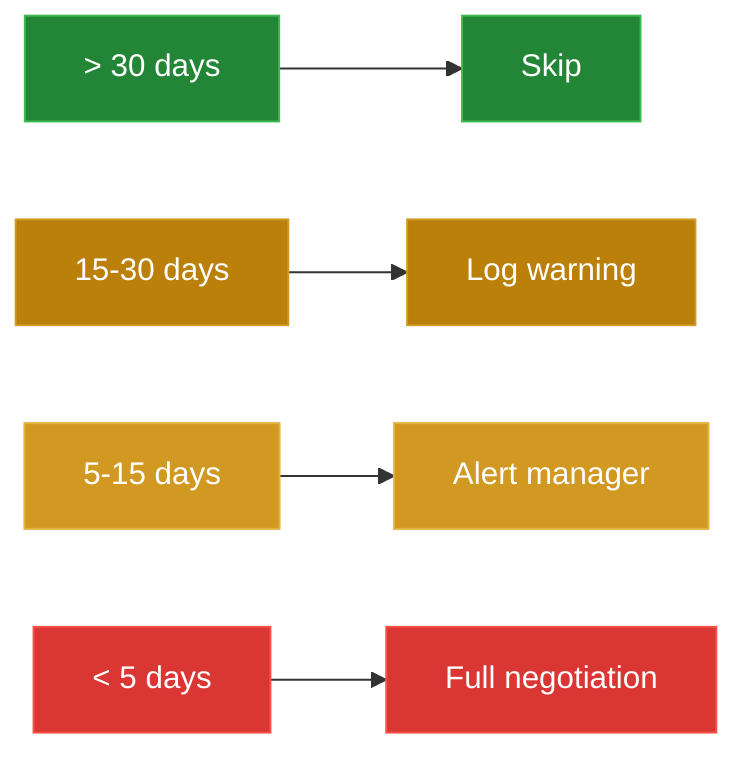

### 7.4 Connector Selection

```python
# Synthetic data (no credentials needed)
connector = SyntheticSCMConnector(suppliers, inventory, models, plants, carriers, demand)

# Live Zoho Inventory
connector = ZohoConnector()

# Zoho with real demand + cost from order history
connector = ZohoConnectorPro(lookback_weeks=12)
```

### 7.5 Auto-Scan Loop

```python
run_forever(
    connector_factory = lambda: ZohoConnectorPro(),
    interval_minutes  = 60,
    max_cycles        = None,        # None = run forever
    buffer_threshold  = 10,
    policy            = {"cost_weight": 1.0, "time_weight": 1.5}
)
```

| Parameter | Default | What It Controls |
|-----------|---------|-----------------|
| `connector_factory` | *required* | Returns a fresh connector each cycle |
| `interval_minutes` | `60` | Pause between scans |
| `max_cycles` | `None` | Stop after N cycles |
| `buffer_threshold` | `10` | Days below which agents trigger |
| `policy` | time-sensitive | Weights for negotiations |

### 7.6 Part-to-Model Mapping

```python
PART_TO_MODELS = {
    "PART_ECU":     ["MODEL_A_SUV", "MODEL_B_SEDAN", "MODEL_C_SUV"],
    "PART_BATTERY": ["MODEL_C_SUV"],
    "PART_SEAT":    ["MODEL_A_SUV", "MODEL_B_SEDAN"],
    "PART_TIRE":    ["MODEL_A_SUV", "MODEL_B_SEDAN"],
}
```

---

## 08 // Connector Abstraction

> *Implement 5 methods. Unlock the entire system for any ERP.*

```python
class SCMConnector(ABC):
    def get_suppliers(self, part_id) -> DataFrame       # All suppliers for a part
    def get_inventory(self, part_id, plant_id) -> dict   # Stock levels at a plant
    def get_avg_weekly_demand(self, model_id) -> float   # Weekly demand for a model
    def get_plant_capacity(self, plant_id) -> dict       # Plant line configuration
    def get_logistics_options(self) -> DataFrame          # Shipping modes available
```

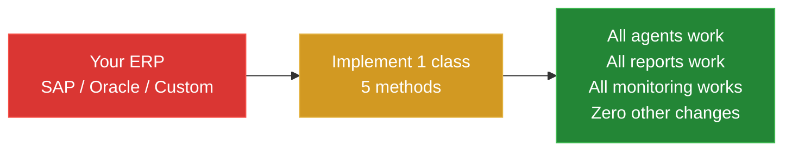

| Connector | Source | Status |
|-----------|--------|--------|
| `SyntheticSCMConnector` | In-memory Pandas tables | Complete |
| `ZohoConnector` | Zoho Inventory REST API | Complete |
| `ZohoConnectorPro` | Zoho + Sales/Purchase Orders | Complete |
| `SAPConnector` | SAP S/4HANA | Planned |
| `OracleConnector` | Oracle SCM Cloud | Planned |

---

## 09 // Agent Scoring Formulas

```
PROCUREMENT AGENT
  score = reliability * (1 - cost_penalty) * capacity_ratio * (1 - lead_time_ratio)

INVENTORY AGENT
  buffer_days = on_hand_units / (avg_weekly_demand / 7)

PRODUCTION AGENT
  utilization_impact = affected_model_demand / total_plant_capacity

LOGISTICS AGENT
  buffer < 5d  --> AIR      buffer < 15d --> RAIL
  buffer < 30d --> TRUCK    buffer > 30d --> OCEAN

ORCHESTRATOR
  score = confidence - (cost * cost_weight / 100) - (delay * time_weight / 10)
```

---

## 10 // Performance Benchmarks

| Component | Synthetic | Live Zoho |
|-----------|:---------:|:---------:|
| Graph Traversal | < 1 ms | < 1 ms |
| Procurement Agent | 0.30 s | 2.50 s |
| Inventory Agent | 0.10 s | 1.80 s |
| Production Agent | 0.15 s | 0.15 s |
| Logistics Agent | 0.12 s | 0.12 s |
| Orchestrator | 0.25 s | 0.25 s |
| Report Generation | 0.40 s | 0.40 s |
| **Total Pipeline** | **1.32 s** | **5.22 s** |

```mermaid
xychart-beta
    title "Response Time by Component (seconds)"
    x-axis ["Procurement", "Inventory", "Production", "Logistics", "Orchestrator", "Report"]
    y-axis "Seconds" 0 --> 3
    bar [0.30, 0.10, 0.15, 0.12, 0.25, 0.40]
    bar [2.50, 1.80, 0.15, 0.12, 0.25, 0.40]
```

---

## 11 // Testing

```
Category                 Cases     Result
---------------------------------------------------
Unit Testing               18      PASS
Integration Testing        12      PASS
Functional Testing         15      PASS
Connector Testing           8      PASS
Performance Testing         6      PASS
Agent Accuracy             10      PASS
---------------------------------------------------
TOTAL                      69      100% PASS RATE
```

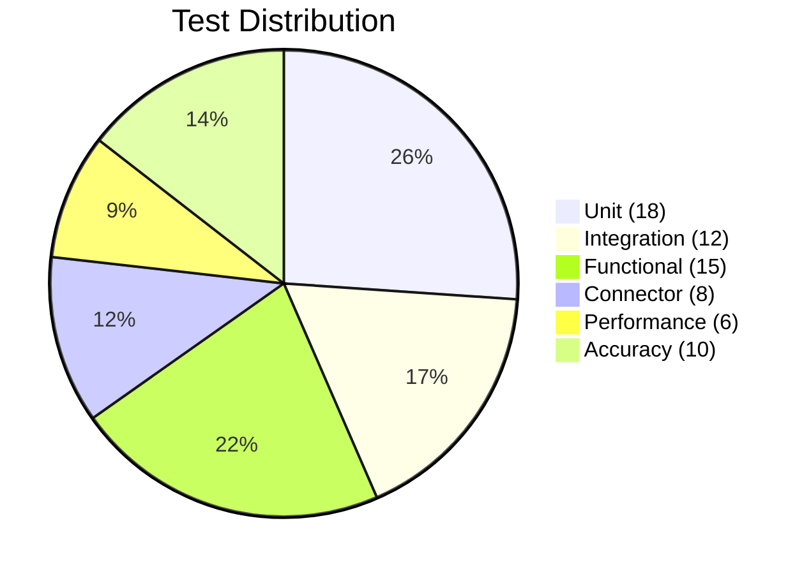

---

## 12 // Roadmap

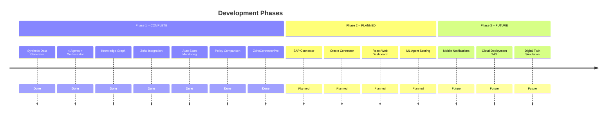

---

## Tech Stack

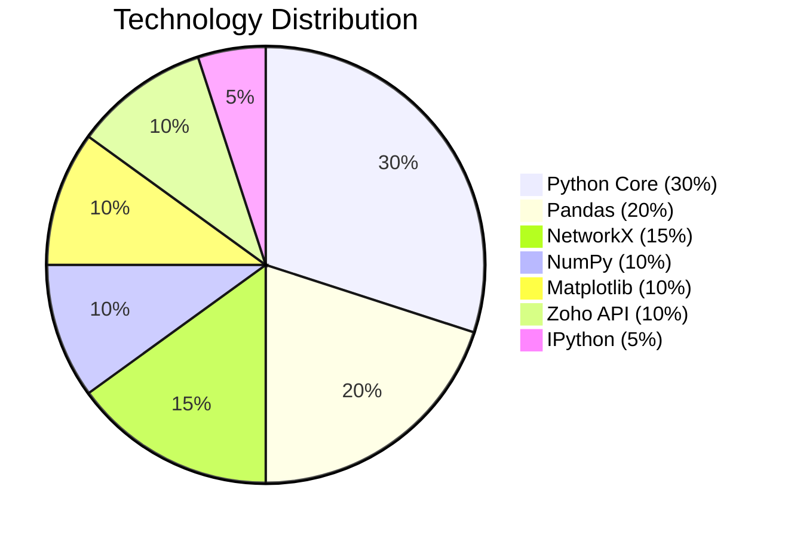

---

## Project Structure

```
automotive_scm_multiagent_v2_fixed.ipynb
|
+-- Section 1-2    DATA LAYER
|   +-- Synthetic data generator (seeded, reproducible)
|   +-- Suppliers, Parts, Models, Plants, Carriers, Demand, Inventory
|
+-- Section 3      CONNECTOR LAYER
|   +-- SCMConnector (abstract) | Synthetic | Zoho | ZohoPro
|
+-- Section 4      KNOWLEDGE GRAPH
|   +-- build_graph() | trace_impact()
|
+-- Section 5-6    AGENT + ORCHESTRATOR LAYER
|   +-- Procurement | Inventory | Production | Logistics | Orchestrator
|
+-- Section 7-8    DEMO LAYER
|   +-- Disruption scenarios | Policy comparison
|
+-- Section 9-14   INTEGRATION LAYER
|   +-- OAuth2 auth | Live vendors + stock | Real demand + cost
|
+-- Section 15-16  OPERATIONS LAYER
    +-- auto_scan_and_respond() | run_forever()
```

---

<div align="center">


<br/>


<br/>

<a href="#"></a>
<a href="#"></a>

</div>
